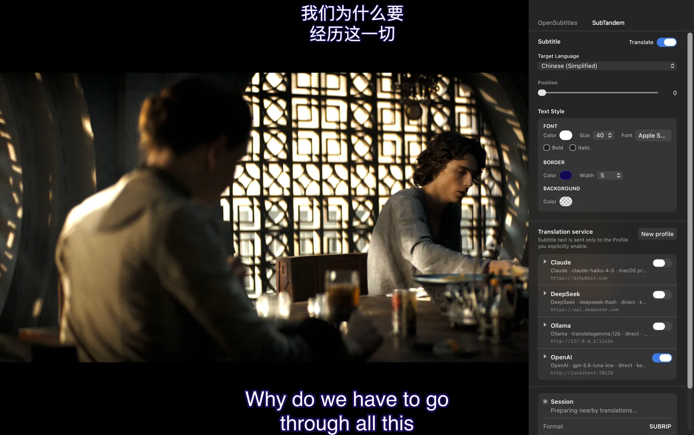
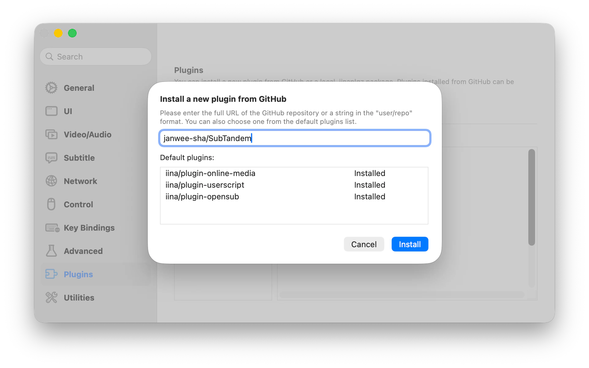
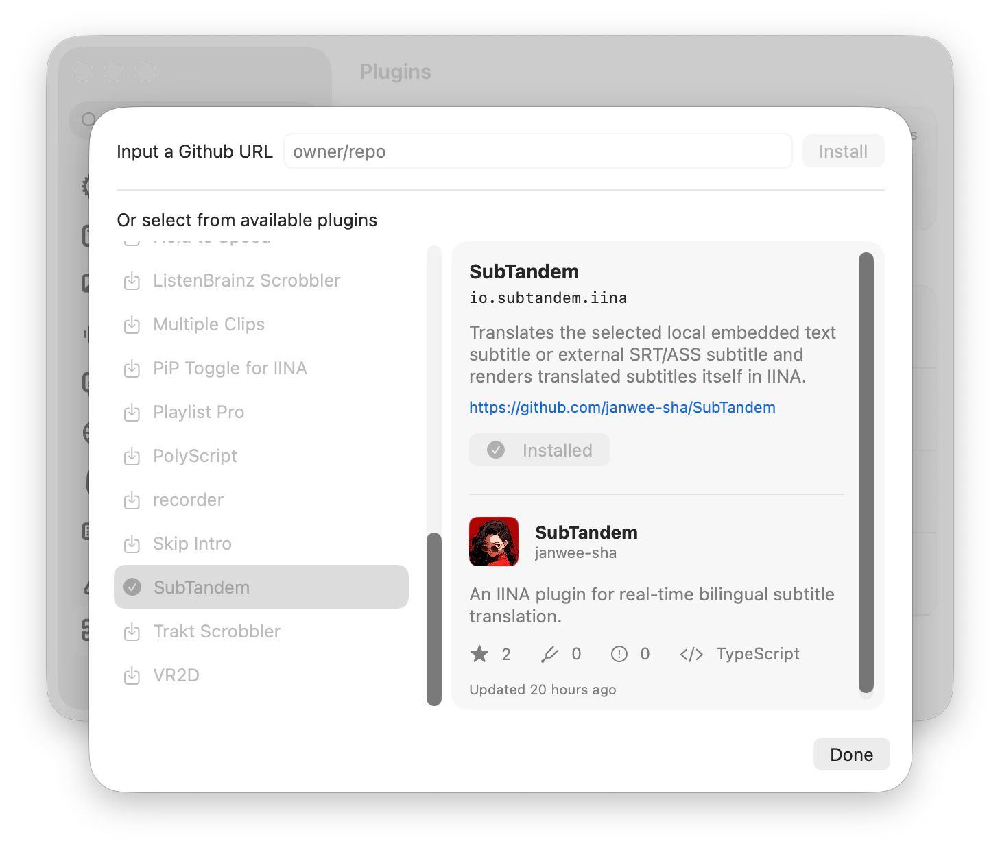

# SubTandem

**Traduction bilingue des sous-titres en temps réel pour IINA**

[English](../../README.md) · [简体中文](README.zh-CN.md) · [한국어](README.ko.md) · [日本語](README.ja.md) · [Русский](README.ru.md) · [العربية](README.ar.md) · **Français**

---

SubTandem traduit le sous-titre texte intégré d'un média local ou le sous-titre externe SRT/ASS actuellement sélectionné dans [IINA](https://iina.io/) et affiche lui-même la traduction dans une surcouche indépendante. Il ne regarde qu'une courte distance devant la position de lecture et traduit par lots limités. Si une traduction prend du retard ou échoue, la vidéo et les sous-titres d'origine continuent d'être lus.

## 🎬 Aperçu

SubTandem conserve les sous-titres d'origine et affiche séparément leur traduction à l'emplacement choisi.

## ✨ Fonctionnalités

- **Sous-titres bilingues en temps réel :** le texte d'origine reste sélectionné dans IINA, tandis que SubTandem centre horizontalement la traduction à la position verticale choisie sans occuper une autre piste.
- **Sous-titres texte intégrés et externes :** prend en charge Matroska SubRip/ASS/SSA et MOV/MP4 `mov_text` locaux, ainsi que les SRT/ASS externes. L'extracteur est inclus ; aucun `ffmpeg` ou `ffprobe` externe n'est requis.
- **Service de traduction au choix :** utilisez un endpoint compatible avec le contrat OpenAI Chat Completions ou un serveur Ollama local/distant.
- **Priorité à la lecture :** la traduction ne met jamais la vidéo en pause et ne masque pas les sous-titres d'origine.
- **Requêtes limitées :** SubTandem ne traduit que les cue proches, limite les tâches simultanées par fenêtre de lecture et ne met en cache les résultats réussis que pendant la session vidéo actuelle.
- **Plusieurs Profile :** enregistrez et testez des Profile de services, puis sélectionnez explicitement l'endpoint précis autorisé à recevoir le texte des sous-titres.
- **Contrôle du proxy :** utilisez les réglages proxy de macOS ou choisissez une connexion directe pour chaque Profile.

## ✅ Configuration requise

- macOS 12 ou version ultérieure
- IINA 1.4.0 ou version ultérieure
- Une piste texte intégrée locale prise en charge ou une piste externe SRT/ASS/SSA lisible
- L'un des services de traduction suivants :
  - Un endpoint OpenAI, un Model ID et une API key si le service l'exige
  - Un serveur Ollama avec un modèle compatible déjà installé

SubTandem ne télécharge ni ne démarre les modèles de traduction.

## 🚀 Installation

Ouvrez IINA et accédez à **Préférences → Modules externes**. Le gestionnaire de modules permet les méthodes d'installation suivantes.

### Installer depuis GitHub (recommandé)

1. Cliquez sur **Installer depuis GitHub…**.
2. Saisissez `janwee-sha/SubTandem` dans le champ `user/repo`, puis confirmez l'installation.
3. Attendez que SubTandem apparaisse dans la liste des modules installés.

SubTandem v0.1.0 inclut les métadonnées de mise à jour IINA. Installez-le avec l’une des méthodes ci-dessus afin qu’IINA puisse rechercher et installer les versions ultérieures.

### Installer un paquet téléchargé

1. Ouvrez la page [Releases](https://github.com/janwee-sha/SubTandem/releases) et téléchargez le dernier paquet `SubTandem-X.Y.Z.iinaplgz`.
2. Revenez dans **Préférences → Modules externes** et cliquez sur **Installer le paquet…**.
3. Sélectionnez le fichier `.iinaplgz` téléchargé et confirmez l'installation.

### Installer depuis la liste des modules (version de développement d’IINA)

Les versions de développement d’IINA permettent d’installer SubTandem directement depuis la liste des modules disponibles.

1. Ouvrez **Préférences → Modules externes**, puis la boîte de dialogue d’installation d’un nouveau module.
2. Sélectionnez **SubTandem** dans la liste des modules disponibles.
3. Confirmez l’installation et attendez que SubTandem apparaisse dans la liste des modules installés.

Quelle que soit la méthode choisie, approuvez les autorisations demandées si IINA les affiche, vérifiez que la case à côté de SubTandem est cochée, puis redémarrez IINA. Lancez ensuite une vidéo, ouvrez la barre latérale d'IINA et sélectionnez l'onglet **SubTandem**.

## 🌍 Démarrage rapide

1. Ouvrez une vidéo locale et sélectionnez dans IINA une piste texte intégrée prise en charge ou un SRT/ASS externe comme sous-titre principal.
2. Dans **Languages**, sélectionnez votre langue maternelle. Si IINA ne peut pas identifier la langue du sous-titre, confirmez-la manuellement, puis enregistrez les réglages.
3. Dans **Translation service**, créez un Profile OpenAI ou Ollama. Si le service exige une authentification, saisissez son API key avant d'actualiser manuellement la liste des modèles. Choisissez ensuite un modèle retourné ou saisissez un Model ID personnalisé exact.
4. Enregistrez et testez le Profile, puis cliquez sur **Select**. La sélection autorise explicitement SubTandem à envoyer le texte des sous-titres proches à l'endpoint affiché.
5. Activez **Translate**. Le sous-titre d'origine reste affiché par IINA et les cue traduits apparaissent dans la surcouche de SubTandem. Utilisez **Translation position** dans **Languages** pour déplacer la surcouche du haut (`0`) vers le bas (`100`).

Si l'endpoint, le modèle, l'API key ou la route réseau change, enregistrez le Profile modifié et sélectionnez-le à nouveau avant de traduire.

## ⚙️ Services de traduction

### OpenAI

- Saisissez l'API root, par exemple `https://example.com/v1`, et non une URL `/chat/completions` complète.
- SubTandem ajoute `/chat/completions` et affiche un aperçu de l'URL finale dans la barre latérale.
- Saisissez l'identifiant exact du modèle exposé par votre service.
- La Bearer API key n'est facultative que si l'endpoint accepte les requêtes sans authentification. Après l'enregistrement, le champ est en écriture seule et la valeur n'est plus affichée.
- Les endpoint distants doivent utiliser HTTPS.

### Ollama

- L'adresse par défaut du serveur est `http://127.0.0.1:11434`.
- Saisissez le tag exact du modèle installé, tel que `translategemma:12b` ou `qwen3:14b`.
- La Bearer API key est facultative si le serveur Ollama accepte les requêtes non authentifiées et reste en écriture seule après l'enregistrement.
- Le test de connexion vérifie le serveur, les tag installés et la prise en charge du structured-output chat.

Pour les deux services, commencez par **Use macOS proxy settings**. Ne choisissez **Connect directly** que si le proxy système configuré empêche l'accès au service.

## 🔒 Confidentialité, identifiants et coûts

- SubTandem envoie uniquement au Profile explicitement sélectionné le texte des cue proches, la direction des langues, des identifiants de cue opaques et un contexte voisin limité. Aucun contenu vidéo ou audio n'est envoyé.
- L'autorisation `video-overlay` affiche la traduction actuelle dans un Overlay local et non interactif. Cet Overlay n'accepte aucune saisie ni déplacement sur la vidéo, n'utilise ni réseau ni stockage WebView et est effacé avec la session de lecture.
- Les API key OpenAI et Ollama sont stockées localement en clair dans le fichier privé `credentials.json` du plugin. Son répertoire utilise le mode `0700` et le fichier le mode `0600`. La key n'est inscrite ni dans les preferences IINA, ni dans les journaux, diagnostics, l'état de la Sidebar ou le paquet du plugin, et elle n'est plus affichée après l'enregistrement.
- Les autorisations du fichier protègent la key contre les autres comptes macOS et les accès accidentels ordinaires. Elles ne la protègent pas d'un processus déjà capable de lire les fichiers au nom de votre utilisateur macOS actuel.
- Le transport helper inclus n'écoute que sur un port temporaire `127.0.0.1`. Un endpoint configuré ou en cours d'édition peut recevoir une liste de modèles sans sous-titres avant Select ; seul le Profile sélectionné reçoit le texte des sous-titres. Les redirect inter-origines et les identifiants inclus dans les URL sont refusés.
- Les traductions ne sont mises en cache que pendant la session vidéo actuelle et sont effacées lors d'un changement de vidéo, à la fin de la lecture ou à la fermeture de la fenêtre.
- Votre Provider de traduction peut facturer les requêtes et appliquer ses propres politiques relatives aux données et au contenu. Le traitement par lots et le cache réduisent les appels, mais ne garantissent pas un coût maximal.

## 📌 Périmètre actuel

SubTandem n'effectue pas de transcription audio, d'OCR ou d'extraction de sous-titres graphiques, d'extraction intégrée depuis un média distant, de prétraduction complète, d'export, de synchronisation cloud ou de cache persistant. Les données temporaires d'extraction sont supprimées après analyse, annulation, délai dépassé ou fermeture.

## 🛠️ Dépannage

- **Select a supported text subtitle :** sélectionnez une piste locale intégrée SubRip/ASS/SSA/`mov_text` ou un SRT/ASS externe. Les pistes graphiques et intégrées distantes ne sont pas prises en charge ; suivez l'état pour resélectionner ou utiliser Retry après un échec.
- **Confirm the subtitle language :** saisissez un tag de langue BCP 47, par exemple `en-US`, puis enregistrez les réglages.
- **Translation service unavailable :** testez le Profile et vérifiez son endpoint, son modèle, son API key, sa route réseau ou le processus Ollama. La vidéo et les sous-titres d'origine continuent normalement.
- **Credential could not be saved :** installez le paquet Release plutôt qu'une copie de développement incomplète, vérifiez que le répertoire de données du plugin est accessible en écriture, puis quittez complètement et relancez IINA.
- **Aucune traduction affichée :** vérifiez que le Profile est testé et sélectionné, que la langue source diffère de votre langue maternelle, que **Translate** est activé et que la lecture se trouve dans l'intervalle d'un cue déjà traduit.
- **Le proxy bloque le service :** essayez d'abord la route proxy macOS par défaut. Si elle refuse le service, passez ce Profile à **Connect directly**, enregistrez-le, puis relancez Select/Test.

## ☕ Soutenir SubTandem

Si SubTandem vous est utile, vous pouvez offrir volontairement un café à son créateur via [Afdian](https://www.ifdian.net/item/ea1ff37a97ed11f19a9f52540025c377?utm_source=copylink&utm_medium=link) ou [Ko-fi](https://ko-fi.com/ianhsia).

SubTandem reste gratuit et entièrement fonctionnel pour tout le monde. Le soutien ne débloque aucune fonctionnalité supplémentaire, traduction prioritaire ou version exclusive, et n'inclut aucun crédit API du service de traduction. Le fournisseur choisi peut facturer séparément selon ses propres conditions et politiques de contenu.
