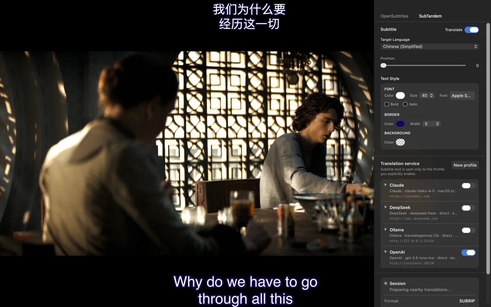
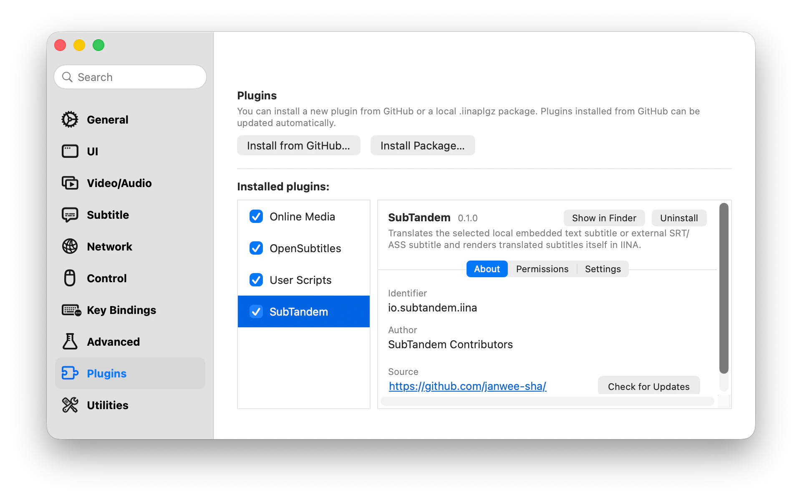
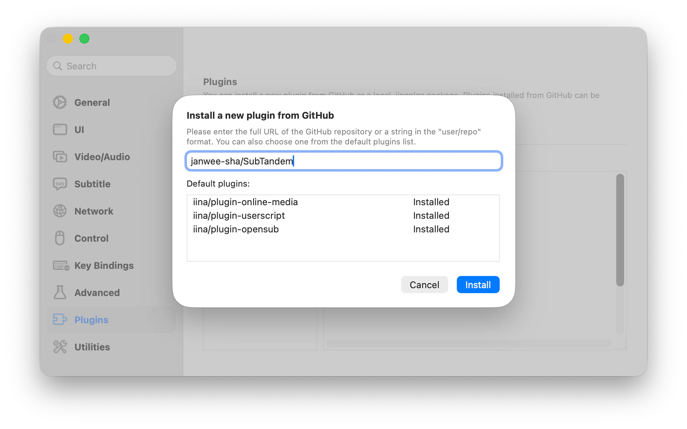
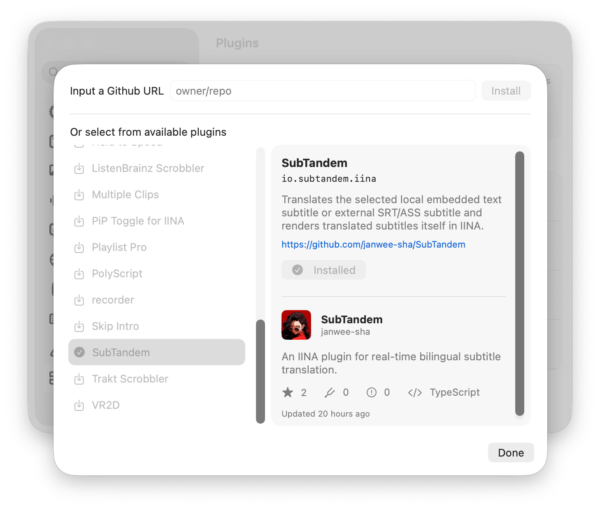

# SubTandem

**Traduction bilingue des sous-titres en temps réel pour IINA**

[English](../../README.md) · [简体中文](README.zh-CN.md) · [한국어](README.ko.md) · [日本語](README.ja.md) · [Русский](README.ru.md) · [العربية](README.ar.md) · **Français**

---

SubTandem traduit le sous-titre texte intégré d'un média local ou le sous-titre externe SRT/ASS actuellement sélectionné dans [IINA](https://iina.io/) et affiche lui-même la traduction dans une surcouche indépendante. Il ne regarde qu'une courte distance devant la position de lecture et traduit par lots limités. Si une traduction prend du retard ou échoue, la vidéo et les sous-titres d'origine continuent d'être lus.

## 🎬 Aperçu

SubTandem conserve les sous-titres d'origine et affiche séparément leur traduction à l'emplacement choisi.

## ✨ Fonctionnalités

- **Sous-titres bilingues en temps réel :** le texte d'origine reste sélectionné dans IINA, tandis que SubTandem centre horizontalement la traduction à la position verticale choisie sans occuper une autre piste.
- **Style de traduction persistant :** réglez sous **Subtitle** la couleur, la Size, la famille et Bold/Italic de Font, la couleur et la Width de Border, ainsi que la couleur de Background. Les valeurs par défaut sont un texte blanc Size 40 en police système, une bordure noire Width 3 et un fond transparent. Les trois couleurs partagent les préréglages et **Show Colors…** avec alpha ; une police enregistrée indisponible utilise temporairement la police système et revient automatiquement lorsqu'elle redevient disponible.
- **Sous-titres texte intégrés et externes :** prend en charge Matroska SubRip/ASS/SSA et MOV/MP4 `mov_text` locaux, ainsi que les SRT/ASS externes. L'extracteur est inclus ; aucun `ffmpeg` ou `ffprobe` externe n'est requis.
- **Service de traduction au choix :** utilisez OpenAI, Claude, DeepSeek ou Ollama. Vous pouvez aussi connecter des services compatibles avec OpenAI ou Claude.
- **Priorité à la lecture :** la traduction ne met jamais la vidéo en pause et ne masque pas les sous-titres d'origine.
- **Requêtes limitées :** SubTandem ne traduit que les cue proches, limite les tâches simultanées par fenêtre de lecture et ne met en cache les résultats réussis que pendant la session vidéo actuelle.
- **Plusieurs Profile :** développez un Profile dans la liste groupée pour le modifier sur place, ou utilisez **New profile** à côté du titre. Test vérifie le brouillon du tiroir courant ; seul l'interrupteur indépendant active une révision enregistrée exacte dans toutes les fenêtres.
- **Contrôle du proxy :** les nouveaux Profile utilisent les paramètres du proxy système par défaut ; choisissez une route réseau pour chaque Profile.

## ✅ Configuration requise

- macOS 12 ou version ultérieure
- Un Mac doté de Secure Enclave pour enregistrer ou utiliser une API key non vide ; les services qui n’en demandent pas restent pris en charge.
- IINA 1.4.0 ou version ultérieure
- Une piste texte intégrée locale prise en charge ou une piste externe SRT/ASS/SSA lisible
- Un service OpenAI, Claude, DeepSeek ou Ollama et un modèle auquel vous avez accès. Consultez les instructions de configuration ci-dessous.

SubTandem ne télécharge ni ne démarre les modèles de traduction.

## 🚀 Installation

Ouvrez IINA et accédez à **Préférences → Modules externes**. Le gestionnaire de modules permet les méthodes d'installation suivantes.

### Installer depuis GitHub (recommandé)

1. Cliquez sur **Installer depuis GitHub…**.
2. Saisissez `janwee-sha/SubTandem` dans le champ `user/repo`, puis confirmez l'installation.
3. Attendez que SubTandem apparaisse dans la liste des modules installés.

SubTandem v0.1.0 inclut les métadonnées de mise à jour IINA. Installez-le avec l’une des méthodes ci-dessus afin qu’IINA puisse rechercher et installer les versions ultérieures.

### Installer un paquet téléchargé

1. Ouvrez la page [Releases](https://github.com/janwee-sha/SubTandem/releases) et téléchargez le dernier paquet `SubTandem-X.Y.Z.iinaplgz`.
2. Revenez dans **Préférences → Modules externes** et cliquez sur **Installer le paquet…**.
3. Sélectionnez le fichier `.iinaplgz` téléchargé et confirmez l'installation.

### Installer depuis la liste des modules (version de développement d’IINA)

Les versions de développement d’IINA permettent d’installer SubTandem directement depuis la liste des modules disponibles.

1. Ouvrez **Préférences → Modules externes**, puis la boîte de dialogue d’installation d’un nouveau module.
2. Sélectionnez **SubTandem** dans la liste des modules disponibles.
3. Confirmez l’installation et attendez que SubTandem apparaisse dans la liste des modules installés.

Quelle que soit la méthode choisie, approuvez les autorisations demandées si IINA les affiche, vérifiez que la case à côté de SubTandem est cochée, puis redémarrez IINA. Lancez ensuite une vidéo, ouvrez la barre latérale d'IINA et sélectionnez l'onglet **SubTandem**.

## 🌍 Démarrage rapide

1. Ouvrez une vidéo locale et sélectionnez dans IINA une piste texte intégrée prise en charge ou un SRT/ASS externe comme sous-titre principal.
2. Dans **Subtitle**, sélectionnez la langue cible exacte. Le service de traduction sélectionné détermine la langue source de chaque cue dans la requête de traduction ; aucune confirmation de langue source n'est requise.
3. Dans **Translation service**, choisissez **New profile** pour créer un Profile OpenAI, Claude, DeepSeek ou Ollama. Les nouveaux brouillons utilisent **Use system proxy settings** par défaut. Si nécessaire, saisissez l'API key avant d'actualiser manuellement les modèles.
4. Utilisez **Test** en bas à gauche pour tester le brouillon courant sans l'enregistrer, puis **Save** à droite et activez son interrupteur indépendant. La sonde fixe de Test peut être facturée, mais n'envoie aucun sous-titre en cours de lecture, n'enregistre pas la nouvelle key et n'active pas le Profile.
5. Activez **Translate**. Le sous-titre d'origine reste affiché par IINA et les cue traduits apparaissent dans la surcouche de SubTandem. Sous **Subtitle**, utilisez **Position** pour déplacer la surcouche du haut (`0`) vers le bas (`100`).
6. Choisissez les huit valeurs dans les groupes **Font**, **Border** et **Background**. Un préréglage de couleur est enregistré directement ; **Show Colors…** ouvre le panneau de couleurs macOS et sa fermeture sans modification conserve la valeur précédente.

Développez le résumé d'un Profile pour le modifier sur place. La ligne d'actions place **Test** à gauche puis **Cancel**, **Delete**, **Save** à droite ; un nouveau brouillon n'affiche pas Delete. Testez les valeurs courantes, enregistrez-les, puis activez la nouvelle révision.

## ⚙️ Services de traduction

### OpenAI

- L’API root par défaut est `https://api.openai.com/v1`. Pour OpenAI, renseignez votre **API key** et choisissez un modèle accessible à votre compte.
- Actualisez la liste des modèles et choisissez-en un, ou saisissez son **Model ID** exact.
- Pour un service compatible avec OpenAI, remplacez **API root** par son API root. SubTandem ajoute `/chat/completions` et affiche l’URL de la requête dans la barre latérale. Laissez **API key** vide si ce service n’en demande pas.

### Claude

- L’API root par défaut est `https://api.anthropic.com/v1`. Pour Claude, renseignez votre **API key** Anthropic et choisissez un modèle accessible à votre compte.
- Actualisez la liste des modèles et choisissez-en un, ou saisissez son **Model ID** exact.
- Pour un service compatible avec Claude, remplacez **API root** par son API root. Si l’API root se termine par `/v1`, SubTandem ajoute `/messages` pour la traduction et `/models` pour le catalogue ; sinon, il ajoute `/v1/messages` et `/v1/models`. Laissez **API key** vide si le service accepte les requêtes sans clé. Vous pouvez alors actualiser les modèles, tester, enregistrer et activer le Profile sans clé.

### DeepSeek

- L’API root par défaut est `https://api.deepseek.com`. Pour le service officiel DeepSeek, renseignez votre **API key** et choisissez un modèle accessible à votre compte.
- Actualisez la liste des modèles et choisissez-en un, ou saisissez son **Model ID** exact. SubTandem ne présélectionne aucun modèle DeepSeek.
- Si votre service utilise une autre API root compatible, modifiez **API root**. SubTandem ajoute `/chat/completions` pour la traduction.

### Ollama

- L’adresse du serveur par défaut est `http://127.0.0.1:11434` pour Ollama sur votre ordinateur. Démarrez Ollama et installez d’abord un modèle compatible.
- Actualisez la liste des modèles et choisissez un modèle installé, ou saisissez son **Model ID** exact.
- Pour un serveur Ollama distant, remplacez **API root** par son adresse. Les requêtes de traduction ajoutent `/api/chat`. Renseignez **API key** seulement si ce serveur l’exige. **Test** vérifie la connexion, le modèle et la prise en charge des sorties structurées.

Les nouveaux Profile utilisent **Use system proxy settings** par défaut. **Network route** s’applique à l’actualisation des modèles, aux tests de connexion et à la traduction ; choisissez **Connect directly** pour contourner le proxy système. Les Profile existants conservent leur route enregistrée, et la route choisie dans le brouillon courant est conservée lorsque vous changez de service puis revenez.

## 🔒 Confidentialité, identifiants et coûts

- SubTandem envoie uniquement au Profile explicitement sélectionné le texte des cue proches, la langue cible exacte, des identifiants de cue opaques et un contexte voisin limité. Le service comprend la langue source dans cette même requête. Aucun contenu vidéo ou audio n'est envoyé.
- L'autorisation `video-overlay` affiche la traduction actuelle dans un Overlay local et non interactif. Cet Overlay n'accepte aucune saisie ni déplacement sur la vidéo, n'utilise ni réseau ni stockage WebView et est effacé avec la session de lecture.
- Les API key sont conservées sous forme de données chiffrées authentifiées dans le fichier privé `credentials.json`, avec les paramètres Profile et les éléments de restauration liés au matériel. Secure Enclave protège les clés de chiffrement. En l’absence de cette protection matérielle, l’enregistrement d’une API key non vide et l’utilisation d’une API key enregistrée échouent. Une API key vide et sa suppression explicite restent possibles. Les API key ne sont inscrites ni dans les preferences IINA, ni dans les journaux, diagnostics ou le paquet. Sur le même Mac et le même compte utilisateur, avec des clés système valides, les API key nouvellement enregistrées restent utilisables après le redémarrage d’IINA, le redémarrage du Mac suivi de la connexion, ou les mises à niveau ultérieures du plugin, sans autorisation supplémentaire, mot de passe principal ni demande biométrique.
- Ouvrez un Profile pour modifier son API key enregistrée. Elle est masquée par défaut ; **Show API key** la révèle uniquement dans le tiroir courant. **Save** la remplace par la saisie actuelle ; enregistrer un champ vide la supprime. Une lecture échouée laisse un champ vide modifiable sans changer les données enregistrées. **Cancel** abandonne les modifications.
- La mise à niveau depuis l’ancien format en clair conserve les paramètres Profile et une sélection activée valide, mais efface les API key enregistrées. Saisissez-les à nouveau au besoin. SubTandem nettoie les copies qu’il gère ; les instantanés APFS/Time Machine, copies hors ligne et autres sauvegardes peuvent conserver les anciennes API key. Renouvelez-les auprès de votre service.
- Sauvegardez le fichier `credentials.json` complet avec ses éléments de restauration associés. La restauration exige l’appareil et l’utilisateur d’origine ainsi qu’un environnement de clés système valide ; elle n’est pas garantie même dans ces conditions. Un autre appareil ou utilisateur ne peut pas récupérer les API key enregistrées ; saisissez-les à nouveau pour chaque Profile.
- Le transport helper inclus n'écoute que sur un port temporaire `127.0.0.1`. Un API root configuré ou en cours d'édition peut recevoir des requêtes de modèles sans sous-titres. **Test** envoie au brouillon courant une sonde fixe sans sous-titres qui peut être facturée ; une nouvelle key n'est utilisée que pour ce test sauf enregistrement séparé. Seule la révision du Profile globalement activé reçoit le texte des sous-titres. Les redirect inter-origines et les identifiants inclus dans les URL sont refusés.
- Les traductions ne sont mises en cache que pendant la session vidéo actuelle et sont effacées lors d'un changement de vidéo, à la fin de la lecture ou à la fermeture de la fenêtre.
- Les pistes courtes, les textes de langue source inconnue et ceux déjà conformes à la langue cible exacte sont quand même envoyés au service sélectionné et peuvent être facturés. Le Provider applique ses propres politiques ; le traitement par lots et le cache de session réduisent les appels sans garantir un coût maximal.

## 📌 Périmètre actuel

SubTandem n'effectue pas de transcription audio, d'OCR ou d'extraction de sous-titres graphiques, d'extraction intégrée depuis un média distant, de prétraduction complète, d'export, de synchronisation cloud ou de cache persistant. Les données temporaires d'extraction sont supprimées après analyse, annulation, délai dépassé ou fermeture.

## 🛠️ Dépannage

- **Select a supported text subtitle :** sélectionnez une piste locale intégrée SubRip/ASS/SSA/`mov_text` ou un SRT/ASS externe. Les pistes graphiques et intégrées distantes ne sont pas prises en charge ; suivez l'état pour resélectionner ou utiliser Retry après un échec.
- **Échec de la traduction :** suivez l'action précise indiquée dans Session. Selon la cause, testez le Profile et vérifiez son API root, son Model ID exact, son API key, sa route réseau, les limites du compte ou le processus Ollama. La lecture et les sous-titres d'origine continuent normalement.
- **Liste de Profile vide au démarrage :** si les paramètres enregistrés ne se chargent pas, **New profile** reste disponible. Les paramètres endommagés peuvent être réinitialisés ; créez et enregistrez un nouveau Profile pour continuer. Un problème d’accès temporaire préserve les Profile valides, qui peuvent réapparaître lorsque l’accès est rétabli. Un échec d’enregistrement conserve le brouillon pour réessayer. L’échec de lecture d’une seule API key ne réinitialise pas la liste.
- **Credential could not be saved :** installez le paquet Release plutôt qu'une copie de développement incomplète, vérifiez que le répertoire de données du plugin est accessible en écriture, puis quittez complètement et relancez IINA.
- **Aucune traduction affichée :** vérifiez que l'interrupteur du Profile voulu et **Translate** sont tous deux activés et que la lecture se trouve dans l'intervalle d'un cue déjà traduit.
- **Problème de réseau ou de proxy :** les nouveaux Profile utilisent les paramètres du proxy système. Vérifiez cette configuration ou choisissez **Connect directly** pour ce Profile, puis enregistrez-le, testez-le et activez la nouvelle révision.

## ☕ Soutenir SubTandem

Si SubTandem vous est utile, vous pouvez offrir volontairement un café à son créateur via [Afdian](https://www.ifdian.net/item/ea1ff37a97ed11f19a9f52540025c377?utm_source=copylink&utm_medium=link) ou [Ko-fi](https://ko-fi.com/ianhsia).

SubTandem reste gratuit et entièrement fonctionnel pour tout le monde. Le soutien ne débloque aucune fonctionnalité supplémentaire, traduction prioritaire ou version exclusive, et n'inclut aucun crédit API du service de traduction. Le fournisseur choisi peut facturer séparément selon ses propres conditions et politiques de contenu.
