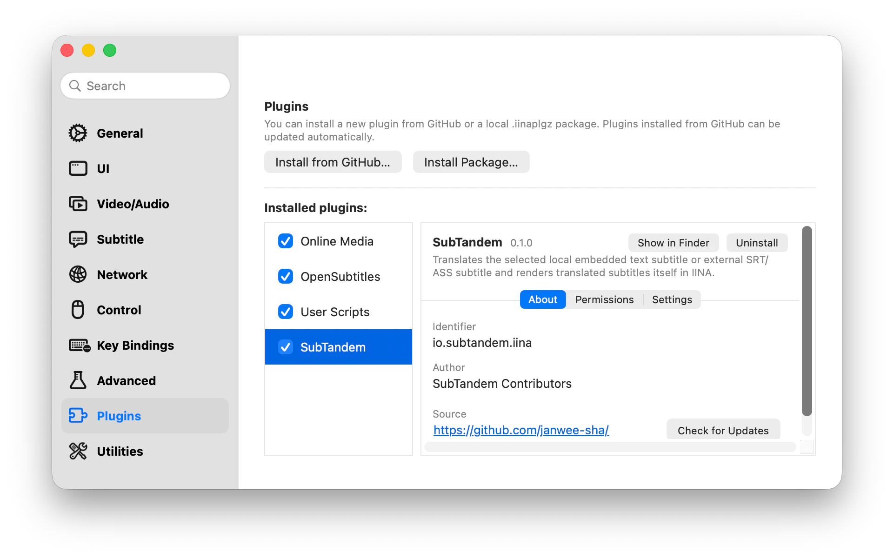

# SubTandem

**Перевод двуязычных субтитров в реальном времени для IINA**

[English](../../README.md) · [简体中文](README.zh-CN.md) · [한국어](README.ko.md) · [日本語](README.ja.md) · **Русский** · [العربية](README.ar.md) · [Français](README.fr.md)

---

SubTandem переводит встроенные текстовые субтитры локального видео или внешний SRT/ASS, выбранный в [IINA](https://iina.io/), и самостоятельно показывает перевод в отдельном оверлее. Плагин обрабатывает только небольшой участок рядом с текущей позицией ограниченными пакетами; при задержке или ошибке видео и оригинал продолжают воспроизводиться.

## ✨ Возможности

- **Двуязычные субтитры в реальном времени:** оригинал остаётся выбранным в IINA, а SubTandem показывает перевод по центру на выбранной вертикальной позиции, не занимая другую дорожку субтитров.
- **Встроенные и внешние текстовые субтитры:** поддерживаются локальные Matroska SubRip/ASS/SSA, MOV/MP4 `mov_text` и внешние SRT/ASS. Extractor включён в пакет; внешний `ffmpeg` или `ffprobe` не нужен.
- **Выбор службы перевода:** можно использовать endpoint, совместимый с контрактом OpenAI Chat Completions, или локальный/удалённый сервер Ollama.
- **Приоритет воспроизведения:** перевод не приостанавливает видео и не скрывает оригинальные субтитры.
- **Ограниченные запросы:** переводятся только ближайшие cue, число одновременных задач ограничено для каждого окна, а успешные результаты кэшируются только в текущем сеансе видео.
- **Несколько Profile:** сохраняйте и проверяйте Profile служб перевода, затем явно выбирайте точный endpoint, которому разрешено получать текст субтитров.
- **Управление прокси:** для каждого Profile можно использовать системный прокси macOS или прямое подключение.

## ✅ Требования

- macOS 12 или новее
- IINA 1.4.0 или новее
- Поддерживаемая локальная встроенная текстовая дорожка или внешний SRT/ASS/SSA
- Одна из следующих служб перевода:
  - OpenAI endpoint, Model ID и API key, если он требуется службой
  - Сервер Ollama с уже установленной совместимой моделью

SubTandem не загружает и не запускает модели перевода.

## 🚀 Установка

Откройте IINA и перейдите в **Настройки → Плагины**. В менеджере плагинов доступны два способа установки.

### Установка с GitHub (рекомендуется)

1. Нажмите **Установить с GitHub…**.
2. Введите `janwee-sha/SubTandem` в поле `user/repo` и подтвердите установку.
3. Дождитесь появления SubTandem в списке установленных плагинов.

SubTandem v0.1.0 содержит метаданные обновления IINA. Установите его с GitHub или из загруженного пакета, после чего IINA сможет проверять и устанавливать последующие версии.

### Установка загруженного пакета

1. Откройте страницу [Releases](https://github.com/janwee-sha/SubTandem/releases) и загрузите последний пакет `SubTandem-X.Y.Z.iinaplgz`.
2. Вернитесь в **Настройки → Плагины** и нажмите **Установить пакет…**.
3. Выберите загруженный файл `.iinaplgz` и подтвердите установку.

При любом способе подтвердите запрошенные разрешения, если IINA их покажет, убедитесь, что флажок рядом с SubTandem включён, и перезапустите IINA. Затем запустите видео, откройте боковую панель IINA и выберите вкладку **SubTandem**.

## 🌍 Быстрый старт

1. Откройте локальное видео и выберите в IINA поддерживаемые встроенные текстовые субтитры или внешний SRT/ASS как основную дорожку.
2. В разделе **Languages** выберите родной язык. Если IINA не может определить язык субтитров, укажите его вручную и сохраните настройки.
3. В разделе **Translation service** создайте OpenAI или Ollama Profile. Если сервис требует аутентификацию, введите API key и вручную обновите список моделей. Выберите возвращённую модель либо введите точный пользовательский Model ID.
4. Сохраните и проверьте Profile, затем нажмите **Select**. Выбор Profile явно разрешает SubTandem отправлять ближайший текст субтитров на показанный endpoint.
5. Включите **Translate**. Оригинал продолжит отображаться в IINA, а переведённые cue появятся в оверлее SubTandem. Параметр **Translation position** в разделе **Languages** перемещает оверлей от верха (`0`) к низу (`100`).

После изменения endpoint, модели, API key или сетевого маршрута сохраните обновлённый Profile и выберите его снова до начала перевода.

## ⚙️ Службы перевода

### OpenAI

- Введите API root, например `https://example.com/v1`, а не полный URL `/chat/completions`.
- SubTandem добавляет `/chat/completions` и показывает итоговый URL запроса на боковой панели.
- Укажите точный идентификатор модели, предоставленный службой.
- Bearer API key можно не указывать только тогда, когда endpoint принимает запросы без аутентификации. После сохранения поле key доступно только для записи и не показывает сохранённое значение.
- Удалённый endpoint должен использовать HTTPS.

### Ollama

- Адрес сервера по умолчанию — `http://127.0.0.1:11434`.
- Укажите точный tag установленной модели, например `translategemma:12b` или `qwen3:14b`.
- Bearer API key необязателен, если сервер Ollama принимает запросы без аутентификации, и доступен только для записи после сохранения.
- Тест подключения проверяет сервер, установленные tag и поддержку structured-output chat.

Для любой службы сначала используйте **Use macOS proxy settings**. Выбирайте **Connect directly** только в том случае, если настроенный системный прокси блокирует доступ к службе.

## 🔒 Конфиденциальность, учётные данные и стоимость

- SubTandem отправляет только явно выбранному Profile ближайший текст cue, направление перевода, непрозрачные идентификаторы cue и небольшой соседний контекст. Видео и аудио не отправляются.
- Разрешение `video-overlay` используется только для показа текущего перевода в локальном неинтерактивном Overlay. Overlay не принимает ввод и перетаскивание на видео, не использует сеть или хранилище WebView и очищается вместе с сеансом воспроизведения.
- API key OpenAI и Ollama хранится локально в открытом виде в приватном файле плагина `credentials.json`. Каталог имеет права `0700`, а файл — `0600`. Key не записывается в IINA preferences, журналы, диагностику, состояние Sidebar или пакет плагина и не показывается снова после сохранения.
- Права файлов защищают key от других учётных записей macOS и обычного случайного доступа, но не от процесса, который уже может читать файлы от имени текущего пользователя macOS.
- Встроенный transport helper слушает только временный порт `127.0.0.1`. Настроенный или редактируемый endpoint может получить запрос списка моделей без субтитров до Select; текст субтитров получает только выбранный Profile.
- Переводы кэшируются только для текущего сеанса видео и удаляются при смене видео, завершении воспроизведения или закрытии окна.
- Provider перевода может взимать плату и применять собственные правила обработки данных и контента. Пакетная обработка и кэширование уменьшают число вызовов, но не гарантируют верхний предел расходов.

## 📌 Текущие границы

SubTandem не выполняет расшифровку аудио, OCR/извлечение графических субтитров, извлечение встроенных субтитров из удалённого медиа, полный предварительный перевод, экспорт, облачную синхронизацию или постоянный кэш. Временные данные удаляются после разбора, отмены, тайм-аута или завершения.

## 🛠️ Устранение неполадок

- **Select a supported text subtitle:** выберите локальную встроенную дорожку SubRip/ASS/SSA/`mov_text` или внешний SRT/ASS. Графические и удалённые встроенные дорожки не поддерживаются; следуйте состоянию для выбора другой дорожки или Retry после ошибки подготовки.
- **Confirm the subtitle language:** введите тег языка BCP 47, например `en-US`, и сохраните настройки языка.
- **Translation service unavailable:** проверьте Profile, endpoint, модель, API key, сетевой маршрут или процесс Ollama. Видео и оригинальные субтитры продолжат воспроизводиться.
- **Credential could not be saved:** установите пакет Release вместо неполной копии для разработки, проверьте доступность каталога данных плагина для записи и полностью перезапустите IINA.
- **Перевод не отображается:** убедитесь, что Profile протестирован и выбран, исходный и родной языки отличаются, **Translate** включён, а текущая позиция находится во временном интервале уже переведённого cue.
- **Прокси блокирует службу:** сначала попробуйте стандартный маршрут прокси macOS. Если прокси отклоняет службу, переключите Profile на **Connect directly**, сохраните и снова выполните Select/Test.

## ☕ Поддержать SubLingo

Если SubLingo оказался полезен, вы можете добровольно угостить автора кофе через [Afdian](https://www.ifdian.net/item/ea1ff37a97ed11f19a9f52540025c377?utm_source=copylink&utm_medium=link) или [Ko-fi](https://ko-fi.com/ianhsia).

SubLingo остаётся бесплатным и полнофункциональным для всех. Поддержка не открывает дополнительные функции, приоритетный перевод или эксклюзивные сборки и не включает кредиты API службы перевода. Выбранный Provider может взимать отдельную плату согласно собственным условиям и политике контента.
